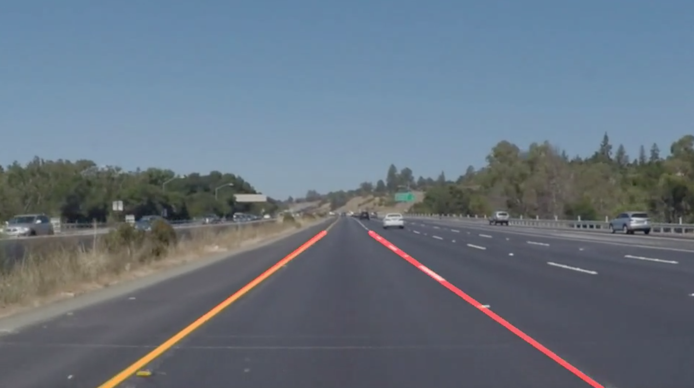
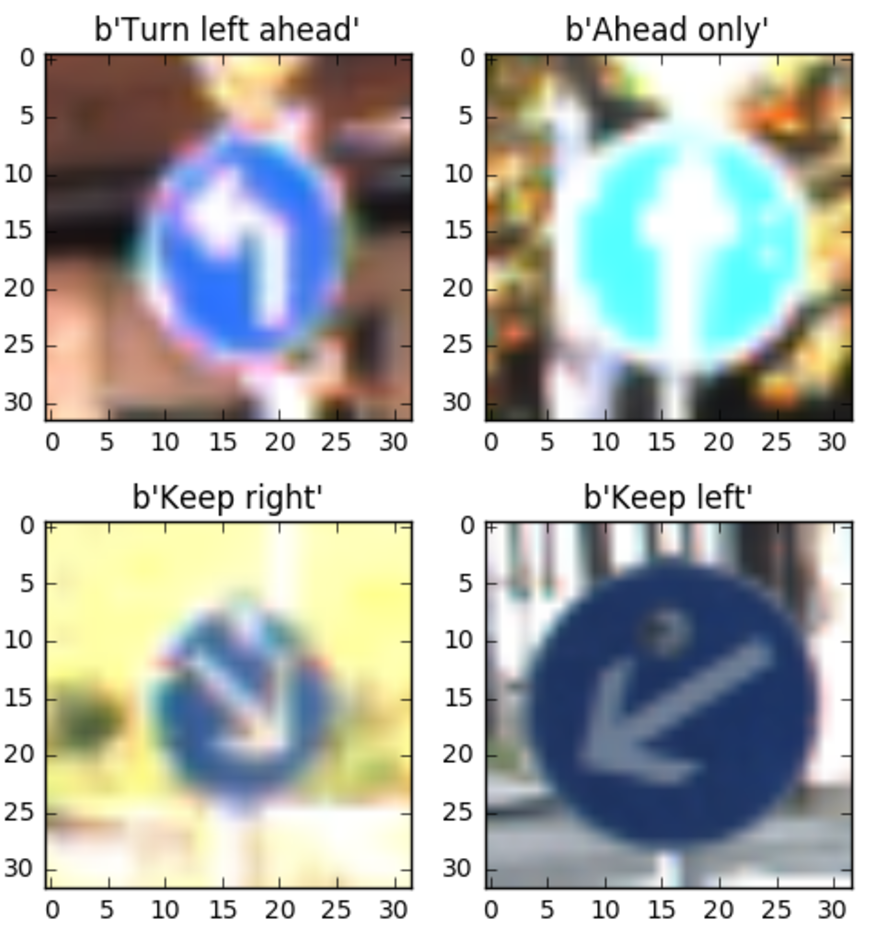
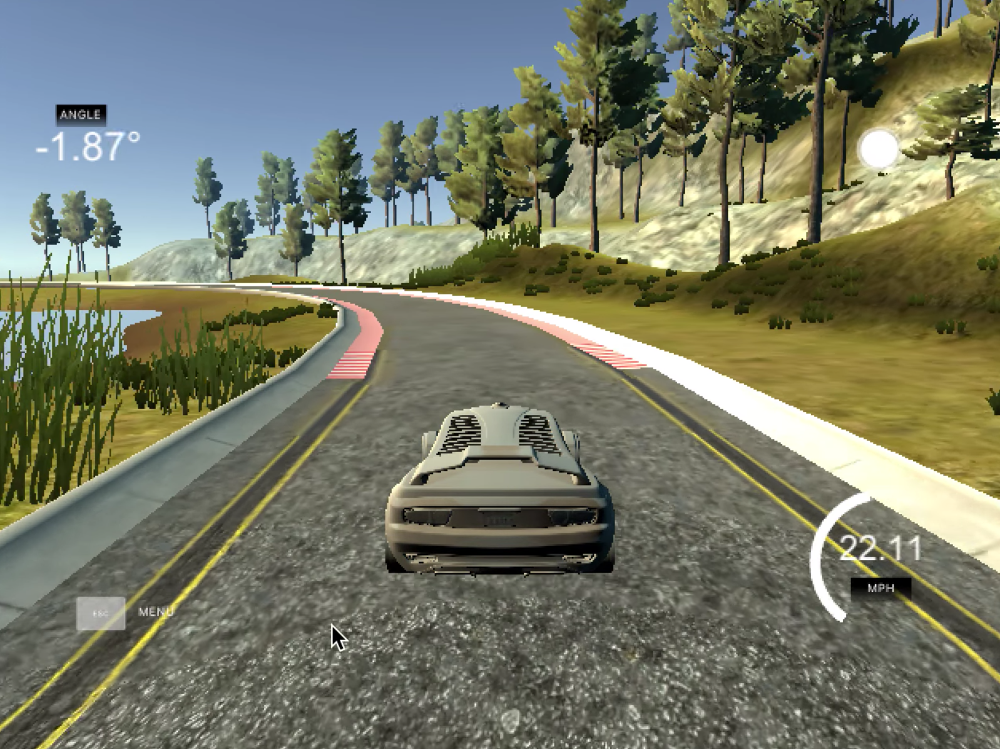
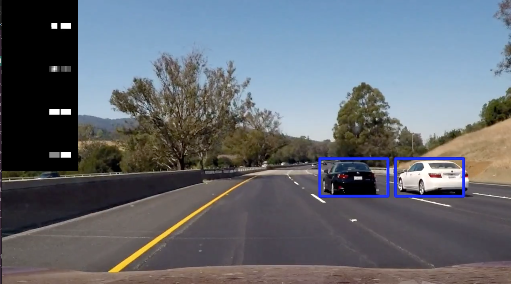

# udacity-sdcnd
Projects implemented within the [Udacity Self-Driving Car Nanodegree](https://www.udacity.com/course/self-driving-car-engineer-nanodegree--nd013),
grouped under one repository:

Project             |  Screenshot
---------------------------|:-------------------------:
**1. Lane Finding**: Basic lane lines detection from a video stream | 
**2. Traffic Signs Classification**: Trained a convolutional neural network with TensorFlow to recognize various traffic signs. | 
**3. Behaviorial Cloning**: Trained a car to autonomously drive in a simulator using a convolutional neural network, implemented with Keras ([YouTube video](https://www.youtube.com/watch?v=X-4ZBYgFSNQ)) | 
**4. Advanced Lane Finding**: Lane detection in various lighting conditions and different curvatures from a video stream ([YouTube video](https://www.youtube.com/watch?v=UGRvXfqt-a8)) | 
**5. Vehicle Detection**: Accurately detected moving cars in a video stream | 

# Instructions
If you plan to test the projects, you'll need to clone the [udacity-sdcnd-data](https://github.com/yrahal/udacity-sdcnd-data) as well.
Both repositories need to sit side-by-side.

I used a jupyter notebook for each project from Term 1. A straightforward way to run them, is to use the
[Docker image](https://hub.docker.com/r/yrahal/udacity-carnd/) I built for this purpose:

1. Make sure you have [Docker](https://www.docker.com/) installed.
2. `cd` to the parent directory of both `udacity-sdcnd` and `udacity-sdcnd-data`
3. `$ docker run -it -v $PWD:/src -p 8888:8888 yrahal/udacity-carnd bash /bin/run_jupyter.sh`. This will
  pull the Docker image on the first run, create a container and run a jupyter server inside.
4. Open `localhost:8888` in your browser and navigate to the project you'd like to test.
